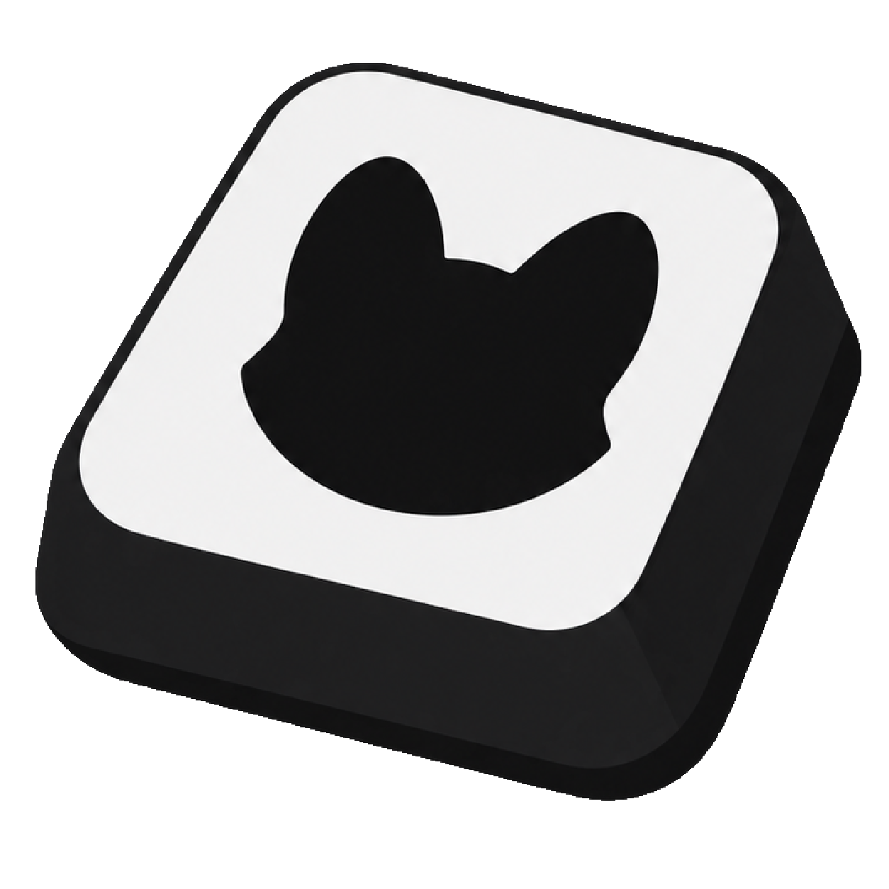

    

    

    <h3>输入可视化覆盖层工具。</h3>
    <h3>实时显示键盘、鼠标和 Xbox 兼容手柄操作，适用于直播、录制、教学和操作展示。</h3>

## 下载与运行

1. 打开最新 Release 页面：https://github.com/uninstall400/PA-Keystroke-Releases/releases/latest
2. 或者访问官网：https://pa-keystroke.github.io
3. 下载 `PA-Keystroke.exe`。
4. 双击运行，按 Windows 提示允许管理员权限。
5. 程序启动后会显示设置主窗口和覆盖层。

程序为免安装版本，不需要安装到固定目录。

## 系统要求

- Windows 10 64 位
- Windows 11 64 位
- 使用手柄时，需要 Windows 能正常识别 Xbox 兼容手柄

## 开始前准备

首次使用时建议按以下顺序操作：

1. 选择输入模式。
2. 添加需要显示的控件。
3. 调整控件位置和尺寸。
4. 设置按键背景、整体缩放和覆盖层不透明度。
5. 点击“保存并应用”。
6. 打开 OBS(或其各分支)，添加“窗口捕获”，选择 `PA Keystroke Overlay`。采集方式请选择 `Windows 10(1903或更新版本)`。

## 选择输入模式

提供三种模式：

- **键盘输入**：始终显示键盘布局。
- **手柄输入**：始终显示手柄布局。
- **自动识别**：根据最近操作的设备，自动切换键盘或手柄布局。

鼠标操作不会触发自动识别模式切换，只有键盘按键和手柄操作会参与判断。

自动识别模式下，预览窗会跟随实际操作的设备切换。为避免误改布局，预览区和预设栏会锁定为只读，不能拖动编辑控件，也不能新增、重命名、删除或切换预设。

## 添加按键

1. 点击“＋ 添加”。
2. 选择“按键”。
3. 在弹窗中填写按键名称。
4. 点击“绑定按键”，然后按下需要显示的键盘按键。
5. 在上方预览中调整位置和尺寸。
6. 点击“保存”。
7. 返回主窗口后点击“保存并应用”。

按键按下时，控件会高亮显示。

## 添加鼠标

1. 点击“＋ 添加”。
2. 选择“鼠标”。
3. 选择是否显示侧键和中键。
4. 在预览中调整鼠标控件的位置和尺寸。
5. 点击“保存”，再点击主窗口的“保存并应用”。

鼠标控件支持：

- 左键
- 右键
- 中键
- 侧键 1
- 侧键 2

## 添加位移指示器

1. 点击“＋ 添加”。
2. 选择“位移指示器”。
3. 调整圆点尺寸、鼠标敏感度和回中速度。
4. 在预览中拖拽控件边缘调整大小和位置。
5. 点击“保存”，再点击“保存并应用”。

位移指示器会显示鼠标移动方向，并在停止移动后逐渐回到中心。

## 添加文本

1. 点击“＋ 添加”。
2. 选择“文本”。
3. 输入需要显示的文字。
4. 设置字体大小、行距、字间距和文字颜色。
5. 设置水平对齐、垂直对齐、粗体和斜体。
6. 根据需要设置描边、阴影和背景。
7. 点击“保存”，再点击“保存并应用”。

文本支持多行和自动换行。

## 添加手柄控件

### 添加整只手柄

1. 切换到手柄输入模式。
2. 点击“＋ 添加”。
3. 选择“整只手柄”。
4. 在预览中调整手柄位置和尺寸。
5. 点击“保存并应用”。

整只手柄会显示：

- A、B、X、Y
- LB、RB
- LT、RT
- 十字方向键
- View、Xbox、Menu
- 左右摇杆

### 添加独立手柄控件

在手柄模式的“＋ 添加”菜单中，可分别选择：

- 手柄按键
- 摇杆
- 扳机
- 文本

添加后可以单独调整位置、尺寸和显示名称。

## 编辑已有控件

在设置页预览中：

- 左键拖动：移动控件
- 拖动边缘：调整尺寸
- 右键：编辑、复制或删除
- 中键拖动或左键拖动空白区域：平移预览区域

完成编辑后必须点击“保存并应用”，覆盖层才会使用新布局。

## 管理预设

预设用于保存多套布局。

1. 在预览窗下方点击预设选择器。
2. 选择已有预设即可切换。
3. 点击“＋ 添加预设”创建新预设。
4. 自定义预设支持重命名和删除。
5. 自定义预设选中后，再次点击以重命名。
6. 只有未被选中的自定义预设可以被删除。
7. 内置预设不能删除，但可以修改显示名称；布局也可以恢复到初始状态。
8. 新建预设后，预设列表会自动滚动到新预设并进入重命名。

键盘预设和手柄预设互相独立。

自动识别模式下，预设栏会锁定并置灰，不能修改预设。操作键盘时会显示键盘当前使用的预设，手柄同理。

同样地，预览窗在此状态下也为只读。

### 导出预设

1. 在预设选择器中点击“导出预设”。
2. 勾选需要导出的键盘预设和手柄预设，可以同时选择多套。
3. 点击“导出”，选择保存位置。
4. 导出文件为 `.json` 格式，包含所选预设的布局和显示名称。

### 导入预设

1. 在预设选择器中点击“导入预设”。
2. 选择一个或多个预设文件，文件格式为 `.json`。
3. 如果导入的预设与现有预设同名，会进入名称冲突处理窗口。
4. 每个冲突项都可以独立选择处理方式：
   - **覆盖**：使用导入的布局替换现有预设。
   - **跳过**：保留现有预设，不导入该项。
   - **副本**：保留现有预设，并将导入项保存为副本。
5. 点击“继续导入”完成处理。

导入完成后会显示成功导入和已执行操作的数量。

### 键盘配列预设

[预设市场]([https://pa-keystroke.github.io/presets.html](https://pa-keystroke.github.io/presets.html))提供可直接导入的键盘配列预设。

您可在使用Github登录后上传您自己的预设。

另外，我们不建议在使用全键盘映射预设时将 整体缩放 调整得过低，这会影响按键的显示。

## 设置按键背景

当“按键背景”显示按键背景被勾选时，你可以：

- 修改背景颜色
- 修改背景不透明度

## 调整覆盖层

### 不透明度

调整“覆盖层不透明度”会改变所有控件和背景的整体透明程度。

### 整体缩放

调整“整体缩放”会使覆盖层的大小发生变化。

### 覆盖层交互

锁定后：

- 鼠标点击会穿透覆盖层
- 覆盖层不会拦截游戏或软件操作
- 覆盖层中的按键、文字和填充不会抢占鼠标

解锁后可以拖动调整覆盖层位置。

### 保存位置

覆盖层位置会自动保存，重新启动后会恢复到原位置。

## 在 OBS 中使用

1. 在 OBS 的来源面板点击“＋”。
2. 选择“窗口捕获”。
3. 在窗口列表中选择 `PA Keystroke Overlay`。采集方式请选择 `Windows 10(1903或更新版本)`。
4. 使用裁剪或滤镜调整显示范围。

不要选择 PA Keystroke 设置主窗口。

## 自动检查更新

程序每次启动时都会检查公开 Release 仓库。检查期间标题栏会显示加载动画，完成后如果没有新版本会自动隐藏。

发现新版本时，标题栏“PA Keystroke”右侧会显示更新提示。点击后可以：

- 查看更新日志
- 打开发布页面
- 下载更新
- 自动替换并重启

更新日志支持保留原文换行，并支持显示 GitHub Release 正文中的远程图片。

你也可以在关于页手动检查更新。

## 数据目录

配置默认保存在：

`%APPDATA%\PA Keystroke`

主要文件：

- `keystroke_config.json`：当前键盘布局
- `keystroke_presets.json`：键盘预设
- `keystroke_gamepad.json`：当前手柄布局
- `keystroke_gamepad_presets.json`：手柄预设
- `user_settings.json`：用户设置/覆盖层和运行设置

备份或迁移数据时，请先退出 PA Keystroke，再复制整个数据目录。

## 常见问题

### Windows 显示“发布者未知”

当前版本未使用受信任的代码签名证书。请确认文件来自公开 Release 仓库，并核对 Release 页面提供的 SHA256。

### 覆盖层挡住鼠标操作

在设置页开启“锁定覆盖层”。锁定后点击会穿透覆盖层。

### OBS 看不到覆盖层

确认使用“窗口捕获”，并选择 `PA Keystroke Overlay`。采集方式请选择 `Windows 10(1903或更新版本)`。

### 手柄没有反应

确认：

- 手柄已被 Windows 识别
- 手柄模式已选择，或自动识别模式已开启
- 已添加整只手柄或对应手柄控件

### 更新没有被检测到

确认：

- 电脑所处的网络环境可以正常访问 GitHub
- 当前版本不是最新版本，且 Release 中包含可下载的更新文件

## 反馈

欢迎向我们提出反馈：https://github.com/uninstall400/PA-Keystroke-Releases/issues

或 QQ 群: 85121371
